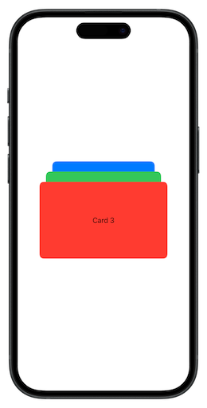

# OverlapStack

`OverlapStack` is a SwiftUI library that simplifies creating overlapping layouts. With `OverlapHStack` and `OverlapVStack`, you can arrange content in customizable horizontal or vertical overlapping stacks with full control over alignment, arrangement, and spacing.


[](https://swift.org/package-manager/)
[](https://cocoapods.org/pods/OverlapStack)
[](https://cocoapods.org/pods/OverlapStack)
[](https://cocoapods.org/pods/OverlapStack)


## Features

- Create overlapping layouts with ease.
-Fully customizable alignment, arrangement, and spacing.
-Supports manual offsets for fine-tuned control.

## Example

To run the example project, clone the repo, and run `pod install` from the Example directory first.

## Requirements

- Swift 5.5 or higher
- iOS 16.0 or higher
- MacOS 13.0 or higher
- TVOS 16.0 or higher
- WatchOS 8.0 or higher
- Xcode 14 or higher

## Installation

### CocoaPods

You can easily install OverlapStack via [CocoaPods](https://cocoapods.org). Add the following line to your Podfile:

```ruby
pod 'OverlapStack', '~> 1.0'
```

### Swift Package Manager (Xcode)

To install using Xcode's Swift Package Manager, follow these steps:

- Go to **File > Swift Package > Add Package Dependency**
- Enter the URL: **<https://github.com/hainayanda/OverlapStack.git>**
- Choose **Up to Next Major** for the version rule and set the version to **1.0.0**.
- Click "Next" and wait for the package to be fetched.

### Swift Package Manager (Package.swift)

If you prefer using Package.swift, add OverlapStack as a dependency in your **Package.swift** file:

```swift
dependencies: [
    .package(url: "https://github.com/hainayanda/OverlapStack.git", .upToNextMajor(from: "1.0.0"))
]
```

Then, include it in your target:

```swift
 .target(
    name: "MyModule",
    dependencies: ["OverlapStack"]
)
```

## Usage

### OverlapVStack

The `OverlapVStack` arranges its subviews in a vertical overlapping layout:

```swift
OverlapVStack {
    Text("Card 1")
        .frame(width: 240, height: 140)
        .background(Color.blue)
        .cornerRadius(10)
    Text("Card 2")
        .frame(width: 270, height: 160)
        .background(Color.green)
        .cornerRadius(10)
    Text("Card 3")
        .frame(width: 300, height: 180)
        .background(Color.red)
        .cornerRadius(10)
}
```

You will end up with a view like this:



You can pass an `OverlapVStackAlignment` and `VerticalOverlapArrangement` to `OverlapVStack` init parameters to configure the View arrangement to meet your need:

```swift
public init(
    alignment: OverlapVStackAlignment = .centered,
    arrangement: VerticalOverlapArrangement = .stackedFromTop,
    defaultOffset: CGFloat = 24,
    @ViewBuilder content: @escaping () -> Content) { 
        // code 
    }
```

| alignment           | arrangement               | UI                                                                           |
|---------------------|---------------------------|------------------------------------------------------------------------------|
| .centered (default) | .stackedFromTop (default) |                                 |
| .centered (default) | .stackedFromBottom        |   |
| .leading            | .stackedFromTop (default) |           |
| .leading            | .stackedFromBottom        |     |
| .trailing           | .stackedFromTop (default) |         |
| .trailing           | .stackedFromBottom        |   |

While the `defaultOffset` is the offset between one overlapped stacked view to another. You can assign the offset manually by the view itself by calling the `overlapOffset` method in view:

```swift
OverlapVStack {
    Text("Card 1")
        .frame(width: 240, height: 140)
        .background(Color.blue)
        .cornerRadius(10)
        .overlapOffset(12) // use 12 as the offset to the next view
        // code 
}
```

Other than overlap offset, there is another offset that can be customized which is alignment offset, which is the offset of the view with its base alignment that can be assigned by calling the `overlapAlignmentOffset` method in view:

```swift
OverlapVStack {
    Text("Card 1")
        .frame(width: 240, height: 140)
        .background(Color.blue)
        .cornerRadius(10)
        .overlapOffset(12) // use 12 as the offset to the next view
        // code 
}
```

Both overlap offset and alignment offset can be described by this diagram:


### OverlapHStack

The `OverlapVStack` arranges its subviews in a vertical overlapping layout:

```swift
OverlapHStack {
    Text("Card 1")
        .frame(width: 240, height: 140)
        .background(Color.blue)
        .cornerRadius(10)
    Text("Card 2")
        .frame(width: 270, height: 160)
        .background(Color.green)
        .cornerRadius(10)
    Text("Card 3")
        .frame(width: 300, height: 180)
        .background(Color.red)
        .cornerRadius(10)
}
```

You will end up with a view like this:


You can pass an `OverlapHStackAlignment` and `HorizontalOverlapArrangement` to `OverlapHStack` init parameters to configure the View arrangement to meet your need:

```swift
public init(
    alignment: OverlapVStackAlignment = .centered,
    arrangement: HorizontalOverlapArrangement = .stackedFromTrailing,
    defaultOffset: CGFloat = 24,
    @ViewBuilder content: @escaping () -> Content) { 
        // code 
    }
```

| alignment           | arrangement                    | UI                                                                            |
|---------------------|--------------------------------|-------------------------------------------------------------------------------|
| .centered (default) | .stackedFromTrailing (default) |                             |
| .centered (default) | .stackedFromLeading            |  |
| .top                | .stackedFromTrailing (default) |          |
| .top                | .stackedFromLeading            |            |
| .bottom             | .stackedFromTrailing (default) |    |
| .bottom             | .stackedFromLeading            |      |

While the `defaultOffset` is the offset between one overlapped stacked view to another. Similar to `OverlapVStack`, you can assign the offset manually by the view itself by calling the `overlapOffset` method in view:

```swift
OverlapHStack {
    Text("Card 1")
        .frame(width: 240, height: 140)
        .background(Color.blue)
        .cornerRadius(10)
        .overlapOffset(12) // use 12 as the offset to the next view
        // code 
}
```

Similar to `OverlapVStack`, there is another offset that can be customized which is alignment offset, which is the offset of the view with its base alignment that can be assigned by calling the `overlapAlignmentOffset` method in view:

```swift
OverlapHStack {
    Text("Card 1")
        .frame(width: 240, height: 140)
        .background(Color.blue)
        .cornerRadius(10)
        .overlapOffset(12) // use 12 as the offset to the next view
        // code 
}
```

Both overlap offset and alignment offset can be described by this diagram:


### Expand Overlap

You can expand the overlapping view by calling the method `expandOverlap` on the view and passing `true` for expanding and `false` for default:

```swift
OverlapVStack {
    Text("Card 1")
        .frame(width: 240, height: 140)
        .background(Color.blue)
        .cornerRadius(10)
        .expandOverlap(true, trailing: 12) // expand the view and add trailing spacing 12 to the next view
        // code 
}
```

Then it will be expanded like this:

| VStack                                 | HStack                                 |
|----------------------------------------|----------------------------------------|
|  |  |

Put them in `ScrollView` and change the value using animation, you can end up with something like this:

| VStack                                                        | HStack                                                        |
|---------------------------------------------------------------|---------------------------------------------------------------|
|  |  |

## Contributing

Contributions are welcome! Please follow the guidelines in the [CONTRIBUTING.md](CONTRIBUTING.md) file.

## License

OverlapStack is available under the MIT license. For more information, see the [LICENSE](LICENSE) file.

## Credits

This project is maintained by [Nayanda Haberty](hainayanda@outlook.com).
